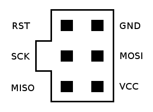

# Motion Detector
Motion detector built on a microcontroller. An alarm will sound when the sensed distance has changed from the calibrated distance that was obtained at startup.

## Setup
1. Install [Atmel Studio 7](https://www.microchip.com/en-us/tools-resources/develop/microchip-studio)
2. Clone this repo
```
$ git clone https://github.com/ChrisRzech/MotionDetector.git
```
3. Create new project in Atmel Studio, and add source files from the `MotionDetector` directory
4. Setup appropriate fuses under "Device Programming" (if you are following the schematic, `SUT_CKSEL` should end up being a version of `Ext. Crystal/Resonator High Freq.`)

## Building device
Please refer to the schematic file under the `docs` directory.

## Flashing device
1. Connect programmer to microcontroller 
2. Power on device
3. Select programmer on Atmel Studio project properties
4. Build solution (F7 by default)